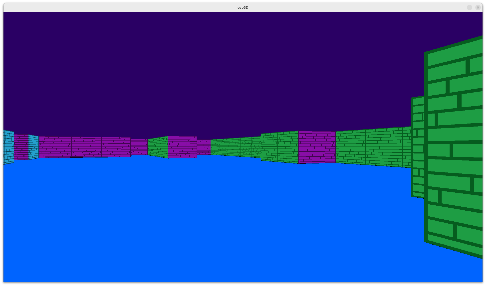

# 🎮 Cub3D

A 42 project building a 3D maze using **raycasting**, inspired by Wolfenstein 3D.

---

## Introduction

Cub3D is a graphical project using the **MiniLibX** library.  
The goal is to create a realistic 3D perspective inside a maze defined by a `.cub` map file, using a technique called **raycasting**.

### Key Concepts

- **Raycasting** — technique that simulates a 3D view by casting rays from the player's perspective
- **Map parsing** — reading and validating a `.cub` configuration file
- **MiniLibX** — graphical library to open windows, render images and handle events
- **Player movement** — handling position, direction and camera plane
- **Textures** — loading and applying custom XPM textures on walls depending on their orientation (N/S/E/W)
- **Floor & ceiling colors** — defined in the `.cub` file

---

### Raycasting

Raycasting simulates a 3D view from a 2D map by casting one ray per vertical column of pixels on the screen.

For each column, the ray travels from the player's position in the direction of that column until it hits a wall. The **distance** between the player and the wall determines the **height** of the wall slice drawn on screen — the closer the wall, the taller the slice.

```
Player
  |
  |--ray 1-->  [wall hit] → tall slice   (close)
  |--ray 2------------>  [wall hit] → medium slice
  |--ray 3-------------------->  [wall hit] → small slice  (far)
```

By repeating this for every column of the screen, a full 3D perspective is rendered — **no real 3D engine needed**, just math and a 2D grid.
## Preview



---

## Usage

### Compilation

```bash
make        # Compile the project
make clean  # Remove object files
make fclean # Remove object files and binary
make re     # Full recompilation
```

### Running

```bash
./cub3D maps/basic_map.cub
```

### Map format `.cub`

```
NO textures/north.xpm
SO textures/south.xpm
WE textures/west.xpm
EA textures/east.xpm

F 220,100,0
C 135,206,235

111111
100001
1000N1
100001
111111
```

| Element | Description |
|---|---|
| `NO` `SO` `WE` `EA` | Path to wall textures (North, South, West, East) |
| `F` | Floor color in RGB |
| `C` | Ceiling color in RGB |
| `1` | Wall |
| `0` | Empty space |
| `N` `S` `E` `W` | Player starting position and direction |

---

## Controls

| Input | Action |
|---|---|
| `W` | Move forward |
| `A` | Move left |
| `S` | Move backward |
| `D` | Move right |
| `←` `→` | Rotate camera left / right |
| `ESC` | Quit the game |

---

---

## Authors

| Name | Role |
|---|---|
|  [ClementTvs](https://github.com/ClementTVS) | Developer |
|  [Arthur-PRZ](https://github.com/Arthur-PRZ) | Developer |

